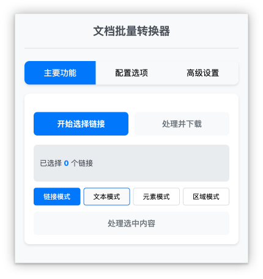
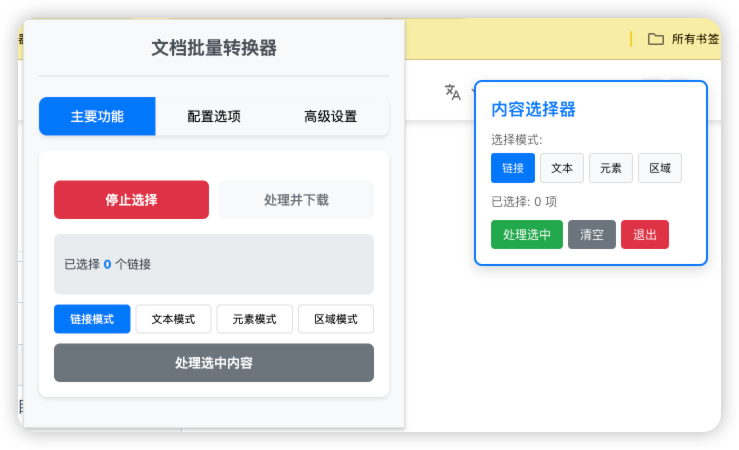
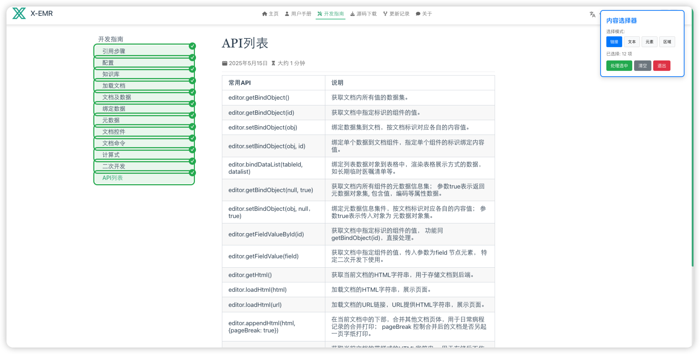
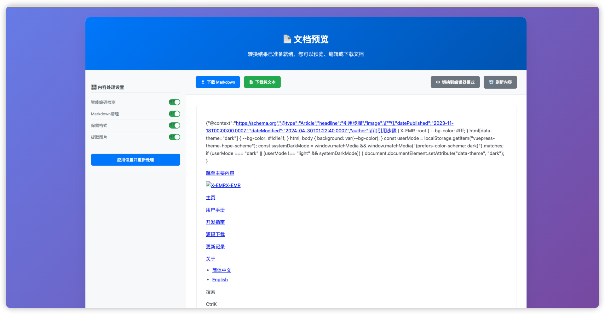

# 百川归档-Batch Doc Converter

一个强大的Chrome扩展，用于批量选择网页链接并将其转换为单个、干净的Markdown文件，支持编辑后下载。

## 🎯 项目简介

百川归档是一个专为内容收集和整理而设计的Chrome浏览器扩展。它能够帮助您从任何网页中批量选择链接、文本或元素，将它们转换为结构化的Markdown文档，并提供强大的编辑和导出功能。

## ✨ 功能特性

### 🔗 多种选择模式
- **链接模式**：批量选择网页中的链接进行转换
- **文本模式**：直接选择网页中的文本内容
- **元素模式**：选择特定的HTML元素
- **区域模式**：选择网页的特定区域

### 📝 智能内容处理
- **Markdown转换**：将HTML内容转换为干净的Markdown格式
- **智能编码检测**：自动识别并处理UTF-8、GBK等多种字符编码
- **内容清理**：自动移除广告、导航栏等干扰元素
- **格式保留**：保持原文的标题、列表、表格等格式结构

### 🎨 高级内容提取
- **展开折叠内容**：自动展开网页中的折叠内容
- **处理懒加载**：支持动态加载的内容
- **提取隐藏内容**：获取被隐藏但重要的信息
- **图片提取**：可选择是否包含图片链接

### ✏️ 强大的编辑功能
- **实时预览**：所见即所得的Markdown预览
- **专业编辑器**：基于EasyMDE的Markdown编辑器
- **语法高亮**：支持Markdown语法高亮显示
- **实时同步**：编辑和预览实时同步

### 📄 多格式导出
- **Markdown格式**：导出为.md文件
- **纯文本格式**：导出为.txt文件
- **批量处理**：支持大量链接的批量转换

### ⚙️ 灵活配置
- **性能设置**：可调整批处理大小、超时时间、重试次数
- **内容策略**：自定义内容提取和处理策略
- **配置导入导出**：支持配置的保存和恢复

## 🖼️ 效果展示

### 主要功能界面

*简洁直观的主界面，支持多种选择模式*

### 配置选项

*丰富的配置选项，满足不同使用需求*

### 内容预览和编辑

*专业的Markdown编辑器和实时预览功能*

### 转换结果展示

*转换后的Markdown文档，格式清晰，结构完整*

## 📁 目录结构

```
batch-doc-converter/
├── src/                          # 源代码目录
│   ├── background/               # 后台脚本
│   │   ├── background.js         # 基础版本
│   │   ├── background_simple.js  # 简化版本
│   │   └── background_enhanced.js # 增强版本
│   ├── content/                  # 内容脚本
│   │   ├── content_select.js     # 基础版本
│   │   ├── content_select_simple.js # 简化版本
│   │   └── content_select_enhanced.js # 增强版本
│   ├── popup/                    # 弹出窗口
│   │   ├── popup.html           # 基础版本
│   │   ├── popup.js             # 基础版本
│   │   ├── popup_enhanced.html  # 增强版本
│   │   └── popup_enhanced.js    # 增强版本
│   ├── display/                  # 显示页面
│   │   ├── display.html
│   │   └── display.js
│   ├── offscreen/                # 离屏页面
│   │   ├── offscreen.html       # 基础版本
│   │   ├── offscreen.js         # 基础版本
│   │   ├── offscreen_enhanced.html # 增强版本
│   │   └── offscreen_enhanced.js # 增强版本
│   └── config/                   # 配置管理
│       └── config_manager.js
├── assets/                       # 静态资源
│   ├── icons/                    # 图标文件
│   │   ├── icon16.png
│   │   ├── icon48.png
│   │   └── icon128.png
│   └── styles/                   # 样式文件
│       ├── styles.css           # 基础样式
│       └── enhanced_styles.css  # 增强样式
├── libs/                         # 第三方库
│   ├── css/
│   │   └── easymde.min.css
│   ├── easymde.min.js           # Markdown编辑器
│   ├── marked.min.js            # Markdown解析器
│   ├── turndown.js              # HTML转Markdown
│   └── turndown-plugin-gfm.js   # GitHub风格Markdown插件
├── tests/                        # 测试文件
│   ├── test_markdown.js
│   └── test_txt_conversion.js
├── docs/                         # 文档
│   ├── README.md
│   ├── ENHANCED_FEATURES.md
│   ├── privacy_policy.md
│   └── images/                   # 效果截图
├── manifest.json                 # 增强版扩展清单
├── manifest_simple.json          # 简化版扩展清单
└── .gitignore                    # Git忽略文件
```

## 🚀 安装说明

### 方法一：开发者模式安装（推荐）

1. **下载项目**
   ```bash
   git clone https://github.com/tangjie502/batch-doc-converter.git
   cd batch-doc-converter
   ```

2. **打开Chrome扩展管理页面**
   - 在Chrome地址栏输入：`chrome://extensions/`
   - 或者：菜单 → 更多工具 → 扩展程序

3. **开启开发者模式**
   - 点击右上角的"开发者模式"开关

4. **加载扩展**
   - 点击"加载已解压的扩展程序"
   - 选择项目文件夹

5. **验证安装**
   - 扩展图标应该出现在工具栏中
   - 点击图标即可使用

### 方法二：打包安装

1. 在扩展管理页面点击"打包扩展程序"
2. 选择项目根目录
3. 生成.crx文件后拖拽安装

## 📖 使用方法

### 基础使用流程

1. **启动扩展**
   - 点击浏览器工具栏中的扩展图标
   - 选择"开始选择链接"按钮

2. **选择内容**
   - **链接模式**：点击网页中的链接进行选择
   - **文本模式**：直接选择文本内容
   - **元素模式**：点击页面元素进行选择
   - **区域模式**：拖拽选择页面区域

3. **开始转换**
   - 选择完成后点击"处理并下载"
   - 等待转换完成

4. **预览编辑**
   - 在预览界面查看转换结果
   - 使用Markdown编辑器进行编辑
   - 实时预览编辑效果

5. **下载文件**
   - 选择下载格式（Markdown或纯文本）
   - 点击下载按钮保存文件

### 高级功能

#### 配置管理
- **内容抓取策略**：调整内容提取的深度和范围
- **选择模式设置**：启用或禁用特定的选择模式
- **性能优化**：调整批处理大小和超时时间
- **配置导入导出**：保存和恢复个人配置

#### 批量处理技巧
- 使用批处理功能处理大量链接
- 设置合适的超时时间避免卡顿
- 启用重试机制提高成功率

## 🛠️ 技术栈

- **前端技术**
  - HTML5, CSS3, JavaScript (ES6+)
  - Chrome Extension Manifest V3
  - Service Worker API

- **Markdown处理**
  - Turndown.js：HTML转Markdown
  - Marked.js：Markdown解析和渲染
  - EasyMDE：专业Markdown编辑器

- **内容处理**
  - 智能编码检测
  - 内容清理和格式化
  - 图片和媒体处理

## 🔧 开发说明

### 本地开发环境

1. **克隆仓库**
   ```bash
   git clone https://github.com/tangjie502/batch-doc-converter.git
   cd batch-doc-converter
   ```

2. **修改代码**
   - 编辑相应的源文件
   - 主要文件位于 `src/` 目录

3. **重新加载扩展**
   - 在Chrome扩展管理页面
   - 点击扩展的"重新加载"按钮

4. **调试**
   - 使用Chrome开发者工具
   - 查看Console日志和错误信息

### 测试

运行测试脚本：
```bash
# 测试Markdown转换功能
node tests/test_markdown.js

# 测试文本转换功能
node tests/test_txt_conversion.js
```

### 构建和打包

1. **准备文件**
   - 确保所有文件都在正确位置
   - 检查manifest.json配置

2. **打包扩展**
   - 在Chrome扩展管理页面
   - 点击"打包扩展程序"
   - 选择项目根目录

## 📝 更新日志

### v1.1.0 (增强版)
- ✨ 新增多种选择模式（链接、文本、元素、区域）
- ✨ 增强的内容提取策略
- ✨ 专业的Markdown编辑器
- ✨ 灵活的配置管理系统
- ✨ 性能优化和批量处理
- ✨ 配置导入导出功能

### v1.0.0 (基础版)
- 🎉 初始版本发布
- ✅ 支持批量链接选择和转换
- ✅ 支持Markdown和纯文本导出
- ✅ 智能格式清理和编码处理
- ✅ 基础的内容预览功能

## 🤝 贡献指南

我们欢迎所有形式的贡献！

### 如何贡献

1. **Fork项目**
   - 点击GitHub页面右上角的Fork按钮

2. **创建分支**
   ```bash
   git checkout -b feature/your-feature-name
   ```

3. **提交更改**
   ```bash
   git add .
   git commit -m "Add: 描述你的更改"
   ```

4. **推送分支**
   ```bash
   git push origin feature/your-feature-name
   ```

5. **创建Pull Request**
   - 在GitHub上创建Pull Request
   - 详细描述你的更改

### 贡献类型

- 🐛 **Bug修复**：报告和修复问题
- ✨ **新功能**：添加新功能或改进
- 📝 **文档**：改进文档和说明
- 🎨 **UI/UX**：改进用户界面和体验
- ⚡ **性能**：性能优化
- 🧪 **测试**：添加或改进测试

## 📄 许可证

本项目采用 [MIT许可证](LICENSE)。

## 🔒 隐私政策

请查看 [隐私政策](privacy_policy.md) 了解详细信息。

## 📞 联系我们

- **GitHub Issues**：[提交问题或建议](https://github.com/tangjie502/batch-doc-converter/issues)
- **项目主页**：[GitHub仓库](https://github.com/tangjie502/batch-doc-converter)

## 🙏 致谢

感谢所有为这个项目做出贡献的开发者和用户！

---

**百川归档** - 让内容收集变得简单高效！ 📚✨

function isExtensionContextValid() {
  return typeof chrome !== 'undefined' && chrome.storage && chrome.storage.local;
}

function safeChromeStorageGet(key, callback) {
  try {
    if (chrome && chrome.storage && chrome.storage.local) {
      chrome.storage.local.get([key], callback);
    }
  } catch (e) {
    console.warn('chrome.storage.local.get 调用失败，扩展上下文可能已失效', e);
  }
}